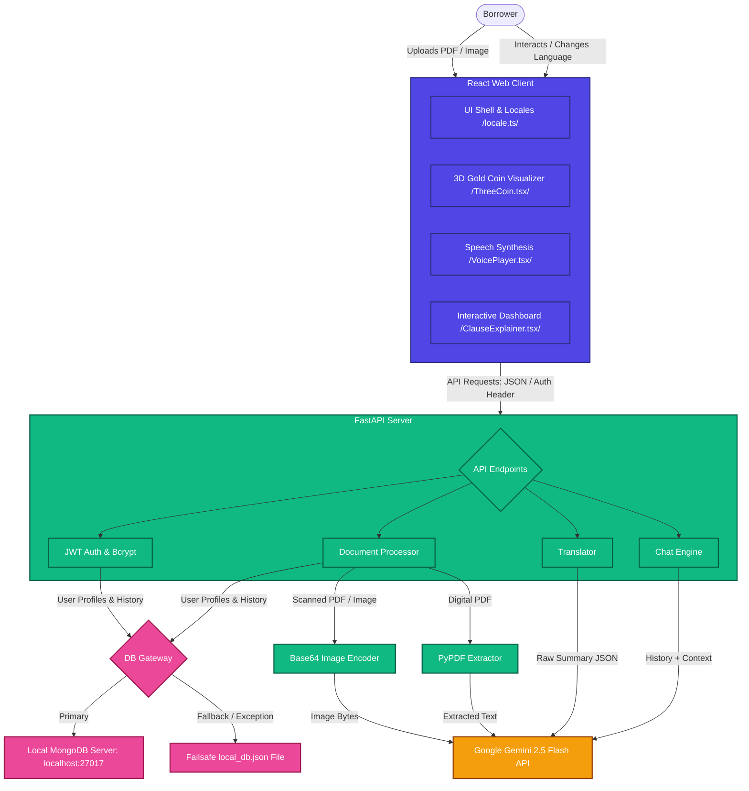

# CrediLens | AI-Powered Loan Fine-Print Explainer

**CrediLens** is an AI-powered financial literacy web application designed to help borrowers in India demystify complex loan agreements and legal fine print. By combining large language models with OCR and regional language localization, CrediLens identifies hidden charges, evaluates loan risks, translates legal jargon, and lets users converse with their loan agreements in their native regional language.

---

## 📐 System Architecture

The following diagram outlines the system architecture, detailing user interaction, the React client components (including Three.js 3D and Speech Synthesis), FastAPI backend pipeline, failsafe database routing, and Google Gemini integration:



---

## 🌟 Key Features

*   **3D Interactive Interface**: A polished WebGL 3D gold coin visualizer powered by Three.js on the login screen that automatically spins and dynamically tilts in response to your mouse cursor movements.
*   **Robust Multilingual OCR**:
    *   **Digital PDFs**: Extracted instantly using fast text parsers.
    *   **Scanned Agreements & Stamp Papers**: Automatically streams image frames to the Google Gemini 2.5 Flash API for advanced multimodal layout parsing, OCR, and handwriting recognition.
*   **Full UI Localization (i18n)**: Toggle the entire web shell (navigation, headers, text inputs, instructions) between **English**, **Hindi (हिंदी)**, **Tamil (தமிழ்)**, **Telugu (తెలుగు)**, **Kannada (ಕನ್ನಡ)**, and **Malayalam (മലയാളം)**.
*   **Speech Synthesizer (TTS)**: Reads simplified loan summaries aloud in the selected regional language. Features an active equalizer visualization and seamless auto-pause/auto-resume when changing languages mid-stream.
*   **Jargon Explainer & Tooltips**: Displays complex legal jargon side-by-side with simple language. High-risk terms are underlined; hovering opens instant explanations.
*   **Failsafe Database Resilience**:
    *   **Local MongoDB Connection**: Connected to `mongodb://localhost:27017/` for zero-configuration, lightning-fast offline operations.
    *   **Dual-layer Fallback**: If the local database goes offline, queries are dynamically routed to a local `local_db.json` file, guaranteeing 100% uptime.
*   **Pairwise Loan Comparison**: Upload two separate offers side-by-side to compare interest rates, hidden fees, total payments, and risk levels with a highlighted suggestion.
*   **Multilingual Chatbot**: Ask questions about your loan agreement and get instant answers in your preferred regional language.

---

## 🛠️ Technology Stack

*   **Frontend**: React, Vite, TypeScript, Three.js (3D rendering), Lucide Icons, Vanilla CSS (Glassmorphism).
*   **Backend**: FastAPI, Uvicorn, Google Gemini 2.5 Flash, PyPDF, Pydantic, PyJWT, Bcrypt, PyMongo.
*   **Database**: Local MongoDB + Local JSON File Fallback.

---

## 🚀 Installation & Running Guide

### Prerequisites
*   [Node.js](https://nodejs.org/) (v18+)
*   [Python](https://www.python.org/) (v3.10+)
*   [MongoDB Community Server](https://www.mongodb.com/try/download/community) (running locally on port `27017`)

---

### Step 1: Environment Variables setup
1. Navigate to the `backend/` folder.
2. Create a `.env` file (you can copy `.env.example`).
3. Add your credentials:
    ```ini
    # Google Gemini API Key (Get a free key from https://aistudio.google.com/)
    GEMINI_API_KEY="YOUR_GEMINI_API_KEY"

    # Local MongoDB Database URI
    MONGODB_URI="mongodb://localhost:27017/"

    # Secret JWT Token Key (used to secure user sessions)
    JWT_SECRET="credilens-secret-key-987654"
    ```

---

### Step 2: One-Click Launch (Windows)
Double-click the **`start.bat`** script in the project root directory. It will automatically:
1. Fire up the FastAPI backend server on `http://127.0.0.1:8000`.
2. Launch the Vite development server for the React client on `http://localhost:5173`.
3. Open your browser directly to the login page.

*Alternatively, you can run them manually in separate terminal tabs:*
*   **Backend**: `cd backend && pip install -r requirements.txt && python -m uvicorn main:app --port 8000`
*   **Frontend**: `cd frontend && npm install && npm run dev`

---

## 🔐 Demo Credentials

To test the application immediately with pre-analyzed loan agreements and history, log in with the following demo account:

*   **Email Address**: `demo@credilens.com`
*   **Password**: `password123`
